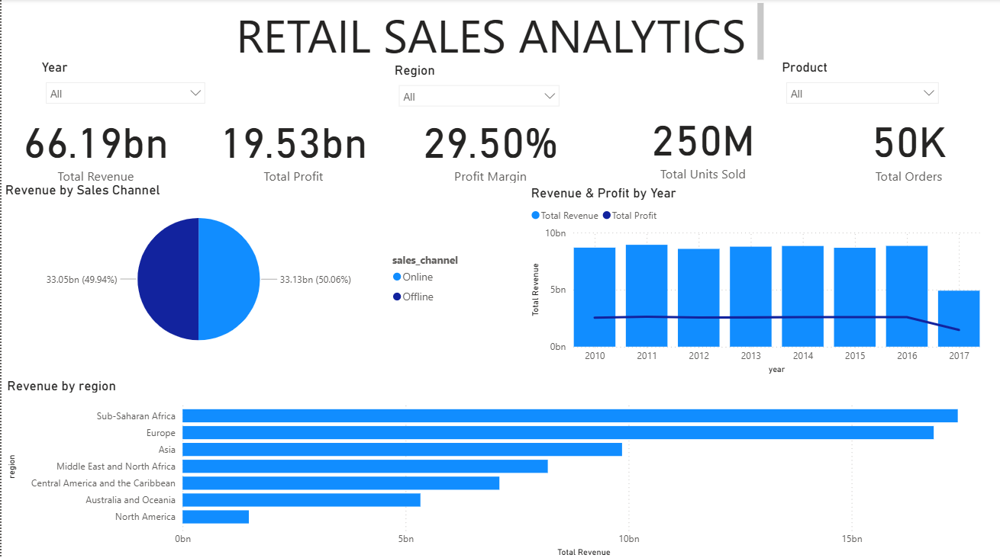
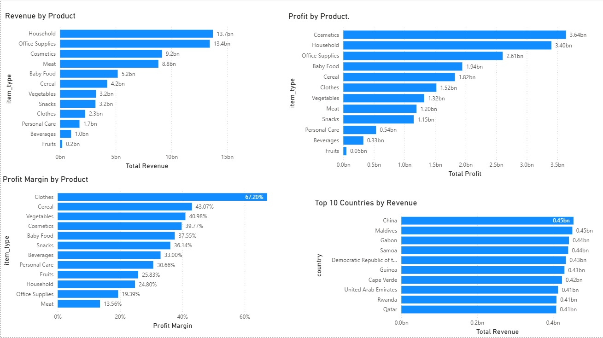
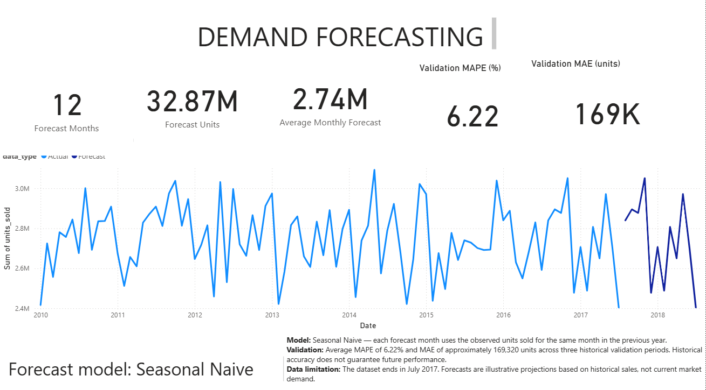

# Retail Sales Analytics and Demand Forecasting

An end-to-end data analytics project that transforms retail sales data into business insights and forecasts future monthly demand using Python, SQL, MySQL, Power BI, and machine learning.

## Project Overview

Retail businesses need to understand sales performance, profitability, regional contribution, and changes in demand to make better business decisions.

This project analyzes 50,000 sales records, builds a relational database for analytical queries, develops an interactive Power BI dashboard, and evaluates forecasting models to predict monthly units sold.

**Project objectives:**
- Analyze revenue, cost, profit, and sales performance.
- Identify high-performing products, regions, and countries.
- Build a structured MySQL database using a star schema.
- Automate data preparation and loading with Python.
- Visualize business KPIs using Power BI.
- Compare forecasting models using chronological validation.

## Tech Stack

| Area | Technologies |
|---|---|
| Programming | Python |
| Data Analysis | Pandas, NumPy |
| Database | MySQL |
| Querying | SQL |
| Visualization | Matplotlib, Seaborn, Power BI |
| Forecasting | Seasonal Naive, SARIMA, XGBoost |
| Evaluation | MAE, RMSE, MAPE |
| Development | Jupyter Notebook, VS Code |
| Version Control | Git, GitHub |

## Project Workflow

1. **Data preparation:** Inspect the source dataset, validate data quality, clean inconsistent text, and prepare date columns.
2. **Database design:** Organize sales data into a star schema with a fact table and supporting dimension tables.
3. **ETL pipeline:** Use Python and Pandas to prepare data and load it into MySQL.
4. **SQL analysis:** Analyze sales performance, profitability, product categories, sales channels, and geographic contribution.
5. **Power BI dashboard:** Present business KPIs and interactive sales analysis.
6. **Demand forecasting:** Aggregate monthly units sold, compare forecasting approaches, validate performance chronologically, and generate a 12-month forecast.

## Dataset

The project uses a sales records dataset containing 50,000 orders.

**Key columns include:**
- Region and Country
- Item Type and Sales Channel
- Order Date and Ship Date
- Units Sold
- Unit Price and Unit Cost
- Total Revenue, Total Cost, and Total Profit

The dataset contains order-level sales records. Since customer, inventory, and stockout information is unavailable, monthly units sold is used as a proxy for demand rather than a measure of unmet demand.

The source dataset and its redistribution terms should be acknowledged and checked before public redistribution.

## Database Design

The MySQL database is named `retail_sales_analytics`.

The star schema contains:

- `fact_sales` — sales transactions and numerical measures.
- `dim_date` — calendar attributes for order and ship dates.
- `dim_product` — product categories.
- `dim_geography` — countries and regions.
- `dim_sales_channel` — online and offline channels.
- `dim_priority` — order priority codes.
- `monthly_forecast` — generated monthly forecast values.

This structure supports analytical queries while keeping descriptive attributes separate from transaction measures.

## Key Business Findings

The analysis produced the following findings:

- **Total revenue:** 66.19 billion
- **Total profit:** 19.53 billion
- **Profit margin:** 29.50%
- **Units sold:** Approximately 250 million
- **Orders analyzed:** 50,000

Additional insights:

- Sub-Saharan Africa and Europe together contributed approximately 51.7% of total revenue.
- Household was the highest-revenue product category.
- Cosmetics generated the highest absolute profit among the product categories.
- Clothes had the highest profit margin, while Meat had the lowest.
- Online and offline sales channels showed very similar revenue, profit, and order volumes.

These findings describe the historical dataset and should not automatically be interpreted as current market conditions.

## Demand Forecasting

Monthly units sold were aggregated into a time series covering January 2010 through July 2017.

**Forecasting approach:**
1. Aggregate transactions into monthly units sold.
2. Split data chronologically to avoid training on future observations.
3. Evaluate Naive and Seasonal Naive baselines.
4. Compare SARIMA and XGBoost models.
5. Use walk-forward validation to compare performance across multiple historical periods.
6. Select the model based on validation results and generate a 12-month forecast.

### Model Comparison

Walk-forward validation covered six-month evaluation periods in 2015, 2016, and 2017.

| Model | Average MAE | Average RMSE | Average MAPE |
|---|---:|---:|---:|
| Seasonal Naive | 169,320 | 210,440 | 6.22% |
| XGBoost | 174,745 | 207,283 | 6.43% |

The **Seasonal Naive model** was selected as the final forecasting model because it achieved lower average MAE and MAPE across the validation periods. XGBoost achieved a slightly lower average RMSE, making it a useful machine-learning benchmark.

The final forecast covers August 2017 through July 2018, the 12 months following the last observed month.

**Important limitation:** The forecast is an experimental projection based on historical data, not a guarantee of future sales. The dataset ends in 2017, so the projected values should not be treated as a current business forecast.

## Power BI Dashboard

The Power BI report organizes the analysis into three pages:

1. **Executive Overview:** Revenue, profit, profit margin, units sold, order count, and regional performance.
2. **Sales Analysis:** Product-level revenue and profitability, profit margins, and top countries by revenue.
3. **Demand Forecasting:** Historical monthly units sold, forecast values, and model validation metrics.

The dashboard uses the MySQL tables as its data source and includes interactive filtering for relevant sales dimensions.

### Executive Overview


### Sales Analysis


### Demand Forecasting


## Project Structure

```text
retail-sales-analytics-forecasting/
├── data/
│   └── 50000 Sales Records.csv
├── figure/
│   └── image.png
├── notebook/
│   ├── sales.ipynb
│   ├── monthly_forecast.csv
│   └── historical_forecast_combined.csv
├── sql/
│   └── 01_business_analysis.sql
├── src/
│   └── data/
│       └── load_to_mysql.py
├── .env.example
├── .gitignore
├── readme.md
└── requirements.txt
```

## Getting Started

### 1. Clone the repository

```bash
git clone https://github.com/sankya-jadhav/retail-sales-analytics-forecasting.git
cd retail-sales-analytics-forecasting
```

### 2. Create a virtual environment

```bash
python -m venv .venv
```

Activate it on Windows:

```powershell
.\.venv\Scripts\Activate.ps1
```

### 3. Install dependencies

```bash
pip install -r requirements.txt
```

### 4. Configure MySQL

Create the MySQL database and prepare the required tables before running the ETL script.

Copy `.env.example` to `.env` and enter your local database configuration:

```env
DB_HOST=localhost
DB_USER=your_mysql_username
DB_PASSWORD=your_mysql_password
DB_NAME=retail_sales_analytics
```

Keep `.env` private. Never commit actual credentials to GitHub.

### 5. Run the analysis

Open `notebook/sales.ipynb` in Jupyter Notebook or VS Code to explore the analysis and forecasting workflow.

Execute `sql/01_business_analysis.sql` in MySQL after the database and required tables have been created and populated.

The ETL script is located at `src/data/load_to_mysql.py`. Ensure the database schema and required dimension tables are ready before executing it.

## Future Improvements

- Add automated data quality checks and ETL logging.
- Improve forecasting with additional historical data and further validation.
- Investigate prediction intervals and forecast uncertainty.
- document the database setup in greater detail.
- Extend the pipeline to support refreshed sales data.

## Author

**Sanket Jadhav**

GitHub: [sankya-jadhav](https://github.com/sankya-jadhav)

This project demonstrates practical skills in data analysis, SQL, ETL development, business intelligence, and time-series forecasting.